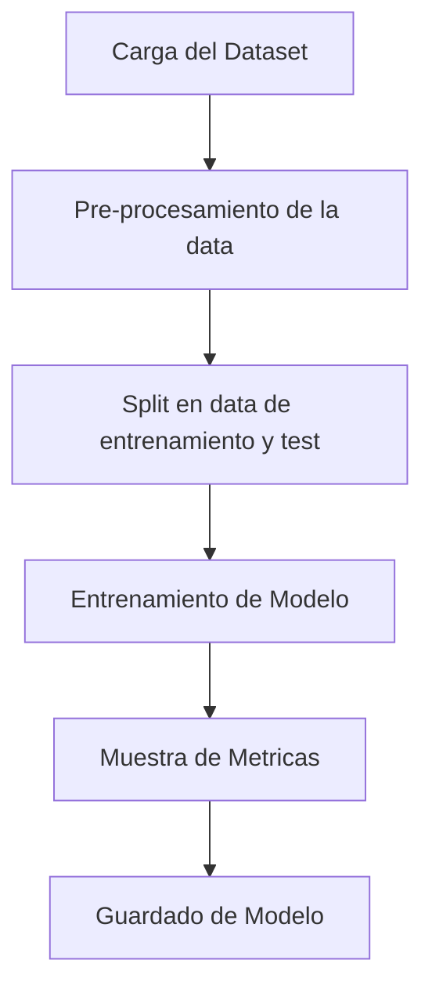
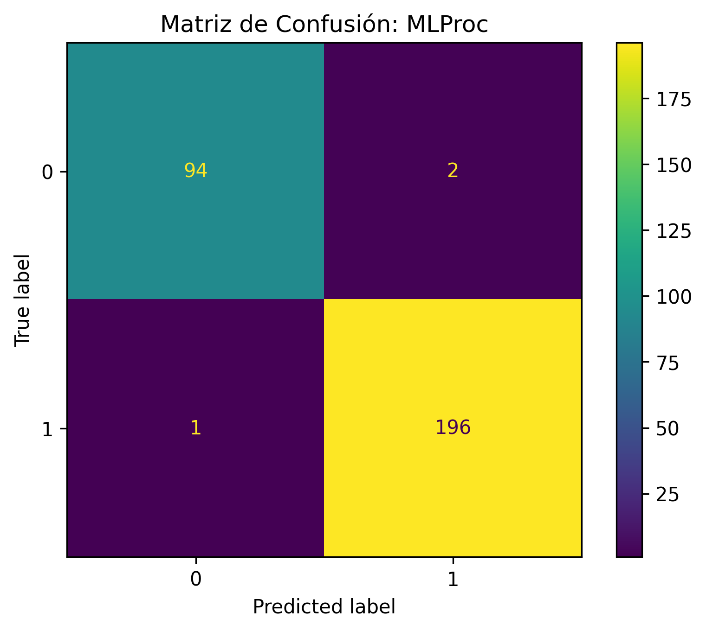

# dsrp-mle-1

<a target="_blank" href="https://cookiecutter-data-science.drivendata.org/">
    
</a>

Trabajo Final para el curso de MLE1

##  Problema de ML
Se busca identificar si un billete es verdadero o falso en base a diferentes dimensiones del billete. El Modelo que se entrenara sera un Regresor Logistico y se comparara con los de Kmeans + PCA.

## Diagrama de flujo del proyecto



## Diccionario de datos
El dataset consta de 1500 filas con 7 columnas.
|  cabecera      |tipo         |
|----------------|-------------|
|**is_genuine**  |boolean      |
|**diagonal**  |float      |
|**height_left**  |float      |
|**height_right**  |float      |
|**margin_low**  |float      |
|**margin_upper**  |float      |
|**length**  |float|

## Project Organization

```
├── LICENSE            <- Open-source license if one is chosen
├── Makefile           <- Makefile with convenience commands like `make data` or `make train`
├── README.md          <- The top-level README for developers using this project.
├── data               <- Dataset for this work.
│
│
├── models             <- Trained and serialized models, model predictions, or model summaries
│
├── notebooks          <- Jupyter notebooks. Naming convention is a number (for ordering),
│                         the creator's initials, and a short `-` delimited description, e.g.
│                         `1.0-jqp-initial-data-exploration`.
│
├── pyproject.toml     <- Project configuration file with package metadata for 
│                         package_dsrp_mle1 and configuration for tools like black
│
├── references         <- Data dictionaries, manuals, and all other explanatory materials.
│
├── reports            <- Generated analysis as HTML, PDF, LaTeX, etc.
│   └── figures        <- Generated graphics and figures to be used in reporting
│
├── requirements.txt   <- The requirements file for reproducing the analysis environment, e.g.
│                         generated with `pip freeze > requirements.txt`
│
├── setup.cfg          <- Configuration file for flake8
│
└── package_dsrp_mle1   <- Source code for use in this project.
    │
    ├── __init__.py             <- Makes package_dsrp_mle1 a Python module
    │
    ├── config.py               <- Store useful variables and configuration
    │
    ├── dataset.py              <- Scripts to download or generate data
    │
    ├── features.py             <- Code to create features for modeling
    │
    ├── modeling                
    │   ├── __init__.py 
    │   ├── predict.py          <- Code to run model inference with trained models          
    │   └── train.py            <- Code to train models
    │
    └── plots.py                <- Code to create visualizations
```

--------
## Resultados

Matriz de confusion de ambos modelos:

**Modelo entenado con regresor logistico**



**Modelo entenado con aplicando PCA+KMeans**


## Conclusiones

De los resultados de ambos modelos se ve que el Modelo Trabajado con Regresor Logistico presenta mejores resultados que al que se entreno con PCA+KMeans. Esto no nesesariamente indica que no se pueda aplicar PCA+KMeans al dataset de este trabajo, el mal resultado del segundo modelo puede ser por que no se aplicaron mas etapas previas de preprocesamiento de la data asi tambien como elegir otros valoroes de los hiperparametros.